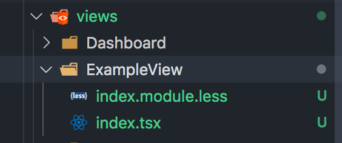
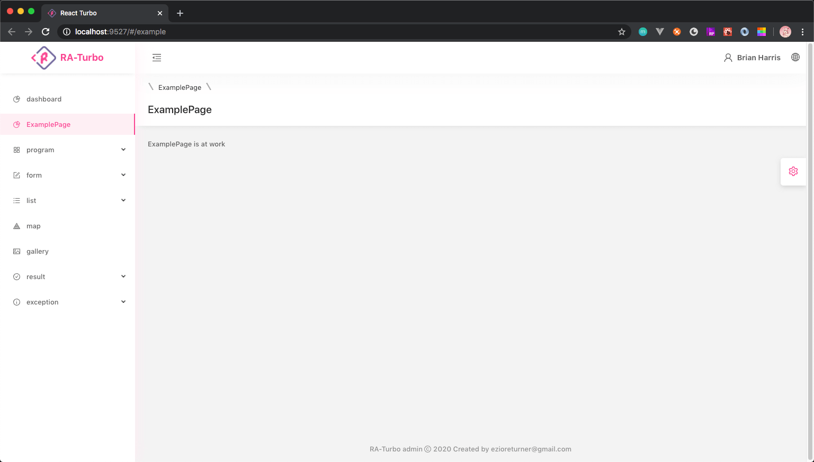
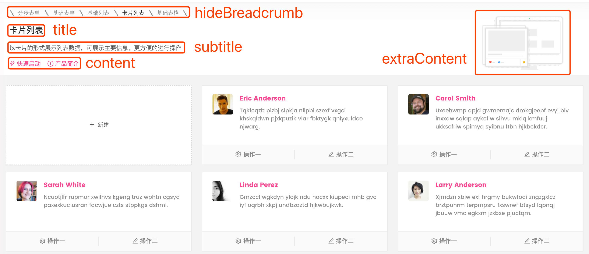

# 新增页面

使用内置指令生成业务或通用『页面』。

## 创建class组件

按照RA的约定，我们通常将业务组件放置在`src/views`目录下，通过下方指令创建一个业务模块：

```bash
yarn raCreate -v exampleView
```

在控制台中将看到以下输出：

```bash
...
yarn run v1.13.0
$ node scripts/tools.js -v exampleView
createType: ···exampleView··· created
✨  Done in 0.27s.
...
```

在 `src/views` 目录下，将自动生成 ExampleView 文件夹包含`tsx、less` 文件，样式默认使用 `CSS Module` ，可参考 [样式与主题](/cssStyle)

</br>



</br>
</br>

并附带了部分代码
```javascript
import React, { Component } from 'react'; 
import style from './index.module.less'; 

class ExampleView extends Component {
	render() {
		return <div>ExampleView now is work!</div>;
	}
}

export default ExampleView;
```


## 创建函数组件

在指令中添加额外配置项 `-fc`  将被创建为函数组件

```bash
yarn raCreate -v exampleFC -fc
```

```javascript
import React from 'react';
import style from './index.module.less';

interface ExampleFCProps {}

const ExampleFC: React.FC<ExampleFCProps> = props => {
  return <div>ExampleFC now is work!</div>;
};

export default ExampleFC;
```


## 定制 page 样式基础模块

在指令中添加额外配置项 `-page` 可以生成附带面包屑以及可定制的header的基础page页面，我们在控制台输入如下代码：

```bash
yarn raCreate -v examplePage -page
```

打开文件后 `examplePage.tsx` 文件我们将看到如下代码：

```javascript
import React, { Component } from 'react'; 
import PageWrapper from '@components/PageWrapper'; 
import FormatterLocale from '@components/FormatterLocale'; 
import style from './index.module.less'; 

class examplePage extends Component { 
  render() {
    return <PageWrapper title={<FormatterLocale id="yourId" defaultMessage="examplePage" />}> 
      ExamplePage is at work!
    </PageWrapper>; 
  } 
} 

export default ExamplePage;
```

> 访问对应的路由后 [路由与菜单](/router)，我们可以看到如下页面，一个附带header头部，body，以及面包屑的基础页面已经生成。

 


## 新增公共组件

公共组件新增与业务组件类似，将指令中的 `-v` 改成 `-c` 即可：

```bash
yarn raCreate -c exampleComponent
```

代码执行后文件将生成在 `src/components` 路径下。

<!-- 
## PageWrapper组件

>上例中，我们引入了PageWrapper组件，该组件接收以下参数：

### hideBreadcrumb

- 类型： `boolean`

  控制是否显示面包屑

### title

- 类型： `string` 或者 `ReactDOM`

### subTitle

- 类型： `string` 或者 `ReactDOM`

### content

- 类型： `string` 或者 `ReactDOM`

### extraContent

- 类型： `string` 或者 `ReactDOM`

详细对应可参考下图，具体使用代码参考 `src/views/List/CardList.tsx` 文件。

 -->