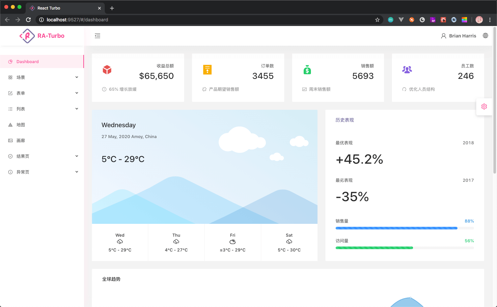
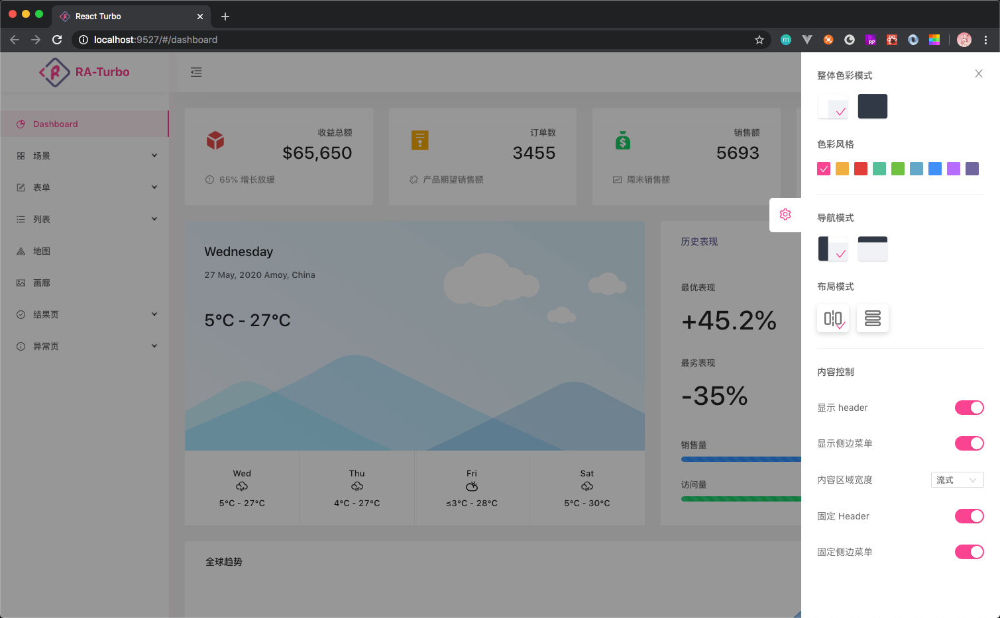
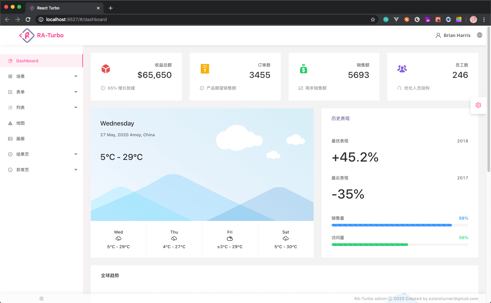
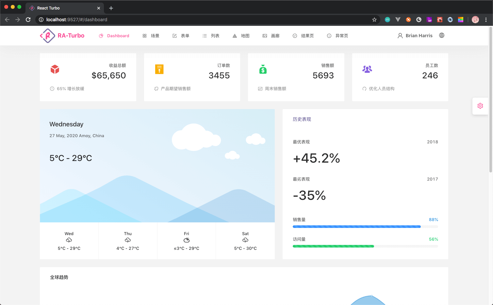

# Layout & 布局

Layout 组件一般的组件不同，它非常重型，在其中集成了 菜单，布局，页头，面包屑，设置抽屉等多种功能。

### RA-Layout

RA 中，默认使用了 splitLayout 分列布局，启动后我们可以看到这样的界面。


 

</br>

对于标题和 logo，Layout 提供了 title和 logo属性来自定，如果你有更强的定制需求，可以试试编写 `components/Layout/SiteDetail.tsx` 文件。


### SettingDrawer

> 由于 SettingDrawer 过于灵活，并且通常业务不需要涉及如此广泛的场景变动，因此不建议在生产环境使用 SettingDrawer 的所有功能。

SettingDrawer 提供了一个图形界面来设置 layout 的配置，方便在演示环境中展示 Layout 的所有能力。




### 嵌套布局

在某些时候可能需要进行 layout 的嵌套，RA-Layout 提供了响应的变更入口。



</br>
</br>

调整方式，设置 layoutStatus 的 layoutMode 属性为 `inline` 即可。

```javascript

interface LayoutStatus extends StoreKeyValue {
  showSiderBar: boolean;
  showHeader: boolean;
  layoutMode: 'split' | 'inline';
  navigateMode: 'vertical' | 'horizontal';
  contentAreaWidthMode: 'max-width' | 'flow';
  fixSiderBar: boolean;
  fixHeader: boolean;
  visionTheme: 'light' | 'dark';
  collapsed: boolean;
  isMobile: boolean;
  currentColor: string;
}

@observable layoutStatus: LayoutStatus = {
  ...
  layoutMode: (layoutMode as 'split' | 'inline') || 'split', // 布局模式
  ...
};
```

### 顶部导航模式

通过设置 layoutStatus 的 navigateMode 属性为 `horizontal` 即可。



## 如何使用

在页面中引入 `BasicLayout` 组件即可，children将填充内容渲染区域。

```javascript
import BasicLayout from '@components/Layout/BasicLayout';

const MainSkeleton: React.FC = props => {
  return (
    <BasicLayout
      {...{
        isHorizontalNavigator: true
      }}
    >
      {<div>view</div>}
    </BasicLayout>
  );
};
export default MainSkeleton;
```
</br>

`BasicLayout` 支持参数

- isHorizontalNavigator `boolean` 

  使用顶部导航，默认为 `false`.

- siderBar `React.ReactNode`

  传入将替换RA基于路由表自动渲染的菜单，默认为空

- siteLogo `React.ReactNode`

  传入将替换项目logo区域，默认为空

- header `React.ReactNode`

  传入将替换header区域所有内容，默认为空

> 可参考 `src/skeleton/Main.tsx`