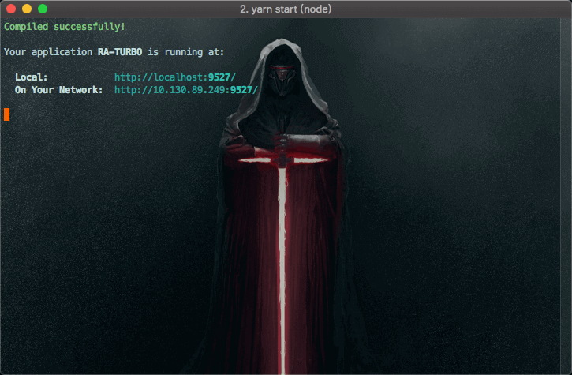

# 快速上手

> 在开始之前，推荐先学习 [React](https://reactjs.org/) 、 [ES2015+](http://es6.ruanyifeng.com/)、 [Mobx](https://mobx.js.org/)、  [Antd Design](https://ant.design/docs/react/introduce-cn), 并正确安装和配置了 [Node.js](https://nodejs.org/zh-cn/) v10 或以上 、[Git](https://git-scm.com/)。提前了解和学习这些知识会非常有帮助。

## 安装

```bash
git clone https://github.com/EzioReturner/RATurbo-react-admin.git
cd RATurbo-react-admin
```

## 功能模块

```bash
- 布局
    - 分列式布局
    - 一体式布局
- 导航菜单
    - 顶部导航
    - 左侧菜单
      - 菜单伸缩
- 组件
    - 路由
      - route 权限校验
      - 异常处理
      - 路由配置渲染route
      - 路由配置渲染菜单
    - 过渡动画
    - 基础页面布局
    - 异步懒加载模块
    - loading遮罩模块
    - i18n 国际化
      - 支持多语言翻译
    - echarts组件
- UI组件
    - 场景
      - 分析页
      - 工作台
      - 监控台
    - 画廊
    - 表单页 
    - 列表页
    - 详情页 (施工中)
    - 结果页
    - 异常页
    - 个人页 (施工中)
- 图表
    - echarts图表
- 页面
    - 登录页面
    - 第三方登录 (施工中)
- 多分辨率 & 移动端适配 
- 支持TypeScript
```

## 目录结构

本应用的目录结构如下

```bash
├── build                   // 默认打包输出目录
├── e2e                     // e2e测试文件夹
├── node_modules            // 黑洞
├── public                  // 静态资源目录
├── scripts                 // 自动化脚本
├── src                     // 项目目录
│    ├── api                // 接口目录
│    ├── assets             // 静态资源路径
│    ├── components         // 组件目录
│    ├── config             // 配置项目录
│    ├── layout             // 布局目录
│    ├── locales            // 国际化文件目录
│    ├── models             // ts 接口声明
│    ├── store              // mobx目录
│    ├── style              // 全局样式目录
│    ├── utlis              // 工具函数目录
│    ├── views              // 页面组件目录
│    └── index.tsx          // 入口文件
├── webpack                 // webpack 配置
├── .babelrc.js             // babelrc 配置
├── .eslintrc.js            // eslint 配置
├── .gitignore              // git 忽略项
├── .prettierignore         // prettier 忽略项
├── .yarnrc                 // yarn 配置项
├── jest-puppeteer.config   // jest-puppeteer 配置项
├── jest.config             // jest 配置项
├── jest.setup.config       // jest 入口文件
├── package.json            // npm 项目及依赖说明
├── README.md               // 项目说明
├── tsconfig.json           // ts 配置
└── yarn-lock               // yarn 依赖说明
```

## 本地开发
推荐使用yarn，若使用npm安装过慢可使用淘宝镜像

1.安装依赖
```bash
yarn install
```

2.启动本地服务器
```bash
yarn start
```

当看到如下界面，就表示项目已经启动。 

 

启动完成后打开浏览器访问 [http://localhost:9527](http://localhost:9527)

 
 
> 如果需要更改启动端口，可在 .env 文件中配置。
